# Fluther: _A Decentralized Dollar Cost Averaging Solution_

## Summary
Fluther is a decentralized dApp for creating recurring token buys over time (aka. dollar-cost averaging). A user can interface with an intuitive UI to log recurring investments, approve amounts for automated spending, view the investment over time, and cancel recurring investments whenever desired, while only paying only a single transaction fee. 

## dApp Problem Statement
While dollar cost averaging is a functionality that exists on multiple centralized trading exchanges- there is a need for a decentralized method that makes use of native Web3 DEXs. Automating recurring buys has been complicated due to the push rather than pull nature of blockchain transactions. This means that a user that would want to make a recurring buy would manually have to sign transactions with their wallet for each buy. 

Fluther overcomes this automation problem by running automation nodes that submit the transactions on behalf of users, but only when the predefined parameters have been met. This creates, for the user- a seamless, gasless dollar-cost average investing experience, while always maintaining 100% control of their funds.

## Dollar Coast Averaging Definition
Dollar-cost averaging is the practice of spending a fixed quantity of one token for the swap of another over time. The idea with this practice is that over the long term, an investor removes the subjective interpretation of when to buy by abiding by a simple rule set. Specifically, invest a certain amount across intervals within a fixed time period. 

The practice of dollar cost averaging is helpful for reducing the effects of market volatility on investments and gives investors peace of mind through a strict rule set. 

## Fluther?
A fluther is a group of jellyfish. Jellyfish have no centralized brain; instead, they have a distributed nervous system. Their bodies are engineered for simplicity, reliability, and function. 

Groups of jellyfish, moreover, are decentralized in their leadership. Jellyfish float together - flow together - through the ocean and make their way as a unified whole. Jellyfish live life untethered from centralization in all they do. 

<p align="center">

</p>

The dApp Fluther, aims to present a similiarly decentralized means for 'flowing' through the realm of Web3 financial investment. Like a jellyfish that floats effortlessly through the ocean; a user can set a recurring investment and let the automation layer trigger the investment 'buys' by employing a simple rule set. 

Sit back and let the tokens swaps amass with Fluther. 

## Flutter dApp UX Features
- <ins>Web3 Connect Button via ThirdWeb:</ins> ThirdWeb provides the connect button which allows a use to potentially connect with more than just MetaMask (though our dApp is built primarily for MetaMask users). Upon connecting the button transforms into an element which presents the network connection logo as well as the amount of test net token on hand. 

Landing View           |  Upon Connect Wallet
:-------------------------:|:-------------------------:
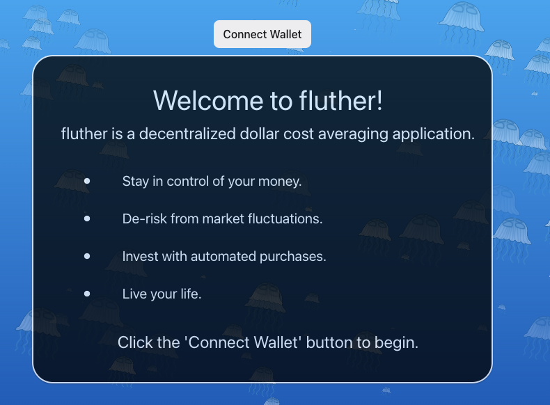  |  

<p align="center">

</p>

- <ins>Connect To Sepolia Network Action:</ins> Users may not be connected to the Sepolia testnet on arrival to the dApp. To accomidate this possiblity we have a view which renders (when not connected to Sepolia) which will present the user with a button to direct connect to the sepolia testnet. Using window.ethereum, as described in the MetaMask sdk we were able to make this accessiblity possible. 

<p align="center">
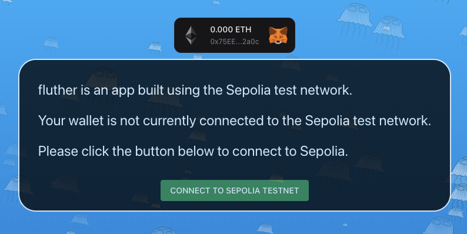
</p>

- <ins>Spending Approval View:</ins> As with many on chain protocols, a user needs to pre-approve spending within our dApp. We get this out of the way early, with a user having to approve at least 100 worth of wETH to begin creating dollar cost average agreements. This approval amount can be changed at any point through button actions later on in the dApp. As dollar cost average swaps accor this approval amount will decrease dynamically.

<p align="center">
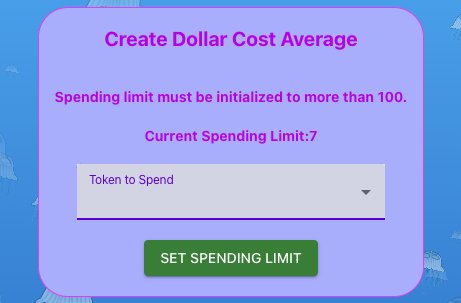
</p>


- <ins>Token Amount Display:</ins> The fluther dApp displays a user's token in real-time. For the purpose of our prototype we have built the application to only support the swap of tokens from WETH to UNI so these are the only tokens on view, at present. When the UNI token grows over time; the text will flash green for a period signalling a dynamic growth. 

<p align="center">
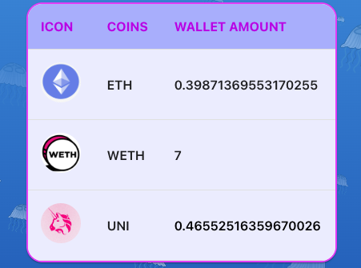
</p>

- <ins>Dollar Cost Average Maker:</ins> The main card element within the application presents users with feilds needed to create a recurring token swap (dollar cost average), once all the feilds are filled a green "Submit Agreement" button appears to process the information. 


<p align="center">
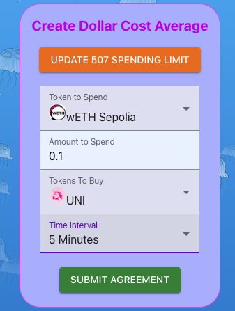
</p>

- <ins>Display User Agreements Dashboard:</ins> A toggle switch at the bottom of the main card allows a user to view all of the Dollar Cost Average agreements made and cancel them as needed.  

<p align="center">
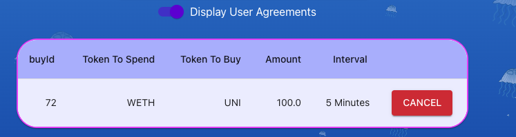
</p>

- <ins>Mock WETH Token Distribution (Floating Action Button):</ins> To use the test application we have created a floating action button which, when clicked, opens a modal where a user can request test WETH token (used specifically for this dApp). The modal menu also has buttons which allow a user to insert the custom tokens directly into their MetaMask wallet. A convenient functionality made possible by the MetaMask SDK. 

Token Fountain Icon           |  Token Fountain Distribution View
:-------------------------:|:-------------------------:
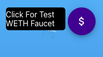  |  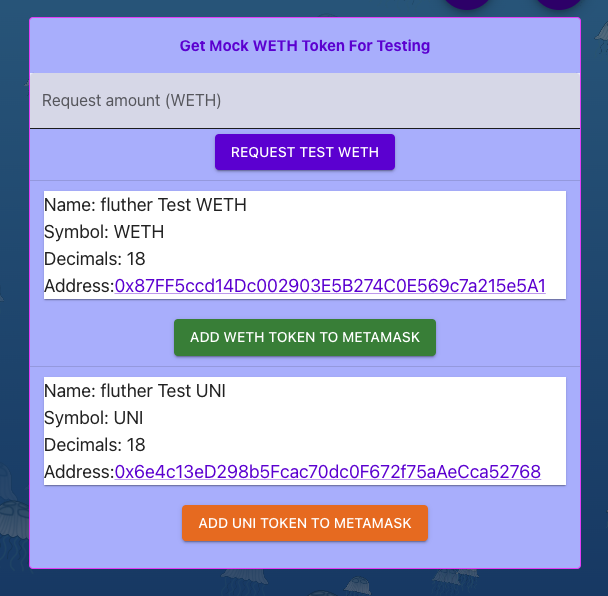

- <ins>Token Investment Visualization:</ins> If a user hovers over the UNI swap token icon they will see a modal prompting for click. Upon click, a visualization appears which charts a user's token growth over time. This data visualization is built off of an Infura Provider object- ensuring reliablity and security with the data pulled for past block timestamp/in relation to token amounts held- to produce the impressive visualization, as a whole. 

Icon to UNI token Visualizaton           |  Token Growth Chart
:-------------------------:|:-------------------------:
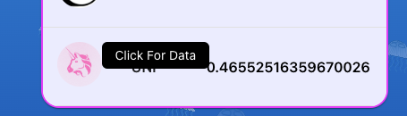  |  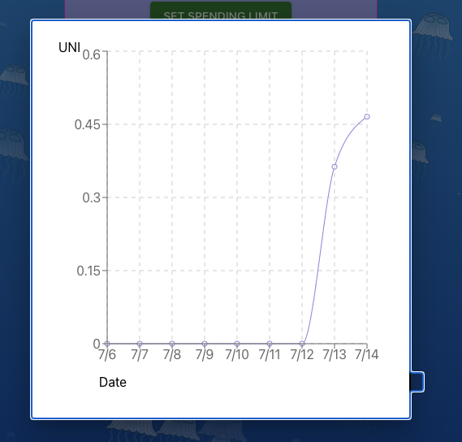


- <ins>Music Embelishment (Floating Action Button):</ins> At the top right of the dApp a user can click on button to play some music. This tranquil music provides a tame backdrop for a user to introspect on on as features load or if they wish to watch their token quantities tick up over time. Music credit goes to--> https://www.bensound.com/. The hot track is: Tenderness.mp3.

<p align="center">

</p>


## Running the dApp locally
To run the dApp locally, an Infura API key is needed. Follow [these instructions](https://www.infura.io/) to create your own API key with Infura. After downloading this repository, create a `.env` file in the `front_end` folder. Copy and paste your created API token in the file with the variable names as follows, replacing in `<INFURA_API_KEY>` and `<PRIVATE_KEY>` with your own details:

`REACT_APP_ETHEREUM_NETWORK = "sepolia"`  
`REACT_APP_INFURA_API_KEY = "<INFURA_API_KEY>"`  
`REACT_APP_SIGNER_PRIVATE_KEY = "<PRIVATE-KEY> "`  

Details on how to access a MetaMask private key can be found [here](https://support.metamask.io/hc/en-us/articles/360015289632-How-to-export-an-account-s-private-key)

### Once the `.env` file is created:

CD into the `front_end` folder, and run:
```
npm install
npm start
```

## Live Deployment
You can try out dollar cost averaging on the testnet! Since a token faucent is embedded into our dApp all you need is [MetaMask wallet](https://metamask.io/download/) and some [Sepolia test ETH](https://sepoliafaucet.com/). 

Click Here to test live deployment--> [HERE](https://fluther.netlify.app/)

## Smart Contract Patterns

- `DollarCostAverage.sol`: governs and manages the dollar cost averaging investments. One needs to register their investment configuration by passing some setting parameters, such as the ERC20 token address to be spent on the cost averaging investment, the amount of that token to be spent, the ERC20 token address to be bought on the investment process. It allows automation of the payment by calling the function `trigger` and passing a valid recurring buy ID.
- `AutomationLayer.sol`: (**NOT YET FUNCTIONAL**) allows the automation of dollar cost averaging payments. This smart contract works with every contract that follows the pattern of `IAutomatedContract.sol` interface. It is possible to prospect how much the node will gain for the automation(s) as well as automate a batch of payments.
- `NodeSequencer.sol`: (**NOT YET FUNCTIONAL**) manages the automation nodes registry and sorts the nodes order (as in a FIFO queue), unabling nodes competition and making the automation process more profitable for the nodes.

In the figure below, the current smart contract structure is shown, with all the current interactions and connections with users, bots, and other smart contracs.
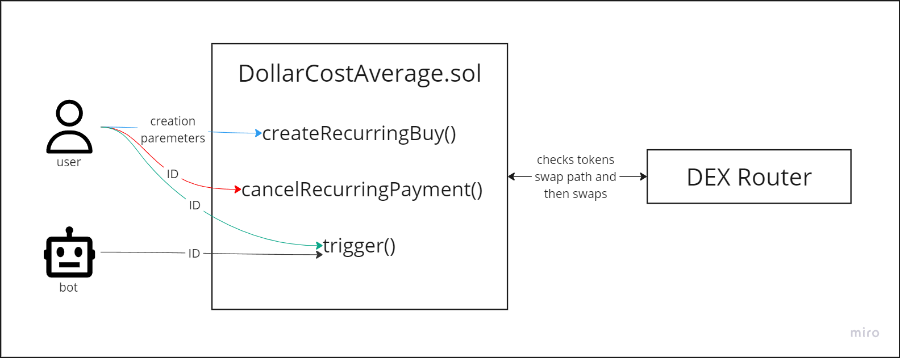

To create a recurring buy (`createRecurringBuy`), the user must provide the following parameters:
- `amountToSpend`: the amount of tokens willing to spend on each payment.
- `tokenToSpend`: the ERC20 token address to spend on each payment.
- `tokenToBuy`: the ERC20 token address to purchase on buy iteraction.
- `timeIntervalInSeconds`: the time interval, in seconds, between each payment.
- `paymentInterface`: the address of a third application that uses this dollar cost average protocol. It can be set to `address(0)` if there isn't any.
- `dexRouter`: a DEX router address to be used in the swap of tokens. If `address(0)` is passed, the default router will be used.

In fact, our frontend application currently takes care of the `paymentInterface` and `dexRouter`, reducing the workload for the users.

To cancel (`cancelRecurringPayment`) or trigger (`trigger`) a recurring payment, just the `recurringBuyId` is needed to pass when calling the functions. Not just the user but also a bot can call the `trigger` function for a specific recurring buy ID.

When a payment is triggered, the `DollarCostAverage.sol` smart contract checks the swap path and, if possible, performs the swap through the registered DEX router. In order for a swap to be successful, there has to be either a liquidity pool of `tokenToSpend` and `tokenToBuy` directly or two liquidity pools: one for `tokenToSpend` and the wrapped native token (i.e. WETH, for the Ethereum network) and one for `tokenToBuy` and wrapped native token as well. This process is illustrated in the following figure.


## Fluther Protocol Fee Breakdown
The Fluther protocol charges a 0.5% fee for each recurring buy. This fee is split 50/50 with the protocol and the front end (currently operated by the Fluther team) that a user uses to set up the recurring buy. These fees are subject to change to optimize for both protocol sustainability and user growth.

The fees are deduced from the spend amount set on the creation of a recurring buy when triggering the payment. There are three types of fees:
1. Payment interface fee: paid to a payment interface. This is applied only if a payment interface address was set when creating the recurring buy.
2. Automation fee: fee paid to the automation nodes. Only applied if an `AutomationLayer.sol` smart contract address is set.
3. Protocol fee: amount paid to the protocol, transferred directly either to a multisig wallet or to an EOA.

## Run your own Fluther frontend
Frontend developers are incentivized to build their own UX on top of the Fluther protocol. Each time a new recurring buy is created through the Fluther protocol one of the parameters is the wallet address of the interface. This address is stored as a state variable associated with the recurring buy and will receive a share of all fees with each swap.
  
## Automation via FlutherNode

A user who has set up a Fluther recurring buy only needs to submit a single transaction. The initial transaction outlines the parameters for each recurring buy including the tokens to be swapped, the amount to swap, and how much time must pass between swaps. All subsequent transactions are automated with `flutherNode.js` located in the `Automation_Nodes` folder.  The following steps outline how to run a fluther node:
  1. cd into the `Automation_Nodes` folder, and from your command line install `ethers 5.6.1` (some newer versions do not work properly)
    
    npm install ethers@5.6.1 --save 

  2. Update global `.env` file with Infura websocket for appropriate chain (`SEPOLIA_WSS`), and signer private key (`TEST_ACCOUNT`)
  3. Optionally install `pm2` globally. 
    
    npm install pm2 -g   

  4. exit out of the automation nodes folder and start the node with `pm2`. 
     
    pm2 start Automation_Nodes/flutherNode.js    
   
### Troubleshooting `flutherNode.js`

Make sure the `dollarCostAverageContractAddress` is the correct contract address for the chain you are automating.
        
## Automation Layer & Further Development

As previously mentioned, the `AutomationLayer.sol` and `NodeSequencer.sol` smart contracts are not yet functional, but they are in the next steps plan. These two smart contracts enable the management of the automation nodes, so that they don't waste funds by competing with each other on triggering the payments. Furthermore, they are also designed in a more generic way, being able to be used with any other smart contract that follows the `IAutomatedContract.sol` interface pattern, as illustrated in the figure below.


With this new smart contracts structure, the nodes will need to be registered in the `NodeSequencer.sol` smart contract to be able to trigger a payment. A specific range of block numbers will be assigned to the node when registered and after triggering the payment at the last block number assigned to it. The following figure shows a diagram of the planed structure for automation.


To make an automation work using this structure, a node/bot must do the following steps:
1. Be sure that the bot possess the required minimum amount of DUH tokens to register.
2. Register using the `registerNode` function in the `NodeSequencer.sol` smart contract.
3. Make sure that the recurring buy is valid in the `DollarCostAverage.sol` smart contract.
4. Create an accout using the `createAccout` function in the `AutomationLayer.sol` smart contract and pass the following parameters:
    - `id`: recurring buy ID to automate.
    - `user`: address of the user that created the recurring buy.
    - `contractAddress`: address of the contract in which the recurring buy is set. In this case, the address of the `DollarCostAverage.sol` smart contract.
5. Call `triggerAutomation` function in the `AutomatioLayer.sol` smart contract and pass the correct ID.

If the `AutomationLayer.sol` smart contract address is set in the `DollarCostAverage.sol`, the process of creating an account will be done automatically when creating a recurring buy.

When the bot registers in the `NodeSequencer.sol` smart contract, a range of block numbers is assigned to it. Every time that the node performs an automation at its last assigned block number, the `NodeSequencer.sol` smart contract will assigned new available block numbers to the node. As previosly mentioned, the nodes are incentivised to automate by receiving automation fees deducted from the buy amount of payment.

A node can cancel its registration by calling `removeNode` function in the `NodeSequencer.sol` smart contract and an automation account can be cancelled as well by calling `cancelAccount` function in the `AutomationLayer.sol` smart contract and passing the account ID as paremeter.

It is the goal of the Fluther team to eventually fully decentralize the Fluther protocol. To do this we have incorporated the following plans for future development:
1. Decentralize the front end. We have incentivized anybody to be able to build a front end on top of the Fluther protocol, this not only expands the reach of the FLuther protocol beyond what would be possible with a centralized frontend but will also create a fully censorship-resistant UX.
2. Decentralize the protocol. As the protocol grows Fluther will likely release a token to govern the protocol.
3. Decentralize the Automation. Currently, Fluther automation Nodes are run by the Fluther team. In the future, we intend to integrate automation with the decentralized Blockhead Finance Automation Layer, which incentivizes node operators to automate transactions on behalf of the protocol.

## Tools and Frameworks used
- <strong>Infura</strong>:
The Fluther dApp makes full use of the Infura API for defining a provider object. This is for making calls to the blockchain to recieve the most up date information on token amounts over time. Infura is used, in particular, for the token visualization feature where a chart is produced of token/time when a user clicks the UNI token logo. 

- <strong>MetaMask SDK</strong>:
Fluther dApp incorperates the MetaMask SDK via the dApp logo being detected on connection with wallet. Furthermore, integration comes from how MetaMask injects itself into the browser via window.ethereum; as described in the SDK, Fluther's test token distrubtion (Floating Action Button) can auto add test tokens to a user's MetaMask without the manual insertion of a token info which can be prone to error. We have also used the SDK to change the user's networkwork via button (to Sepolia) on click- if they are connected to any other network when using Fluther. 

- <strong>Ethers.js</strong>:
Ethers.js is used as a utility library for converting amounts between on chain values and those consumed on the front end. Furthermore, to keep the 'signer' object dynamic (per app usage)- a provider object from Ethers.js Web3 is created to write state changes to the blockchain. 

- <strong>ThirdWeb</strong>:
As a nod to Web3 builders, Fluther as appropraited the Web3 connect button to allow users to connect with multiple wallets aside from MetaMask. The user's blockchain address is parsed from this element and used throughtout the dApp. Third web is also used to detect a change in networkID if a user is to toggle this within dApp. 

- <strong>Foundry</strong>: All smart contracts from Fluther were developed and deployed using Foundry framework. Unit tests as well as stateless and stateful fuzz tests were created and executed using this framework.

- <strong>Slither</strong>: Automated static analysis was carried out using the Slither framework.

- <strong>Chainlink Price Feed</strong>: To ensure that dollar cost average agreement investment amounts meet a cetain threshold (at least $20 USD per investment); a Chainlink price feed is used to pull dynamic pricing for the swap value, USD/ETH. This value is then employed on the front end for form validation. 

## Team
- [@kitfud](https://github.com/kitfud)
- [@EWCunha](https://github.com/EWCunha)
- [@GZRdev](https://github.com/GZRdev)
- [@DopaMIM](https://github.com/DopaMIM)

